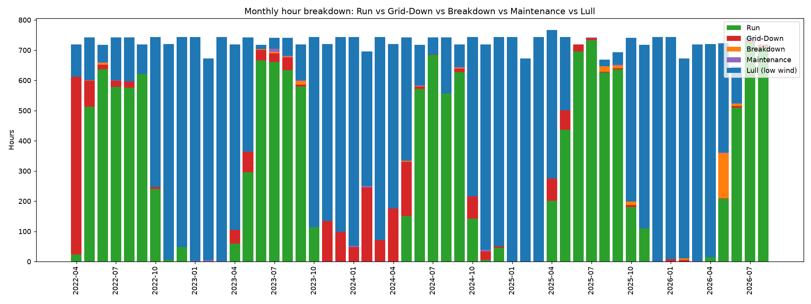

# wind-turbine-loss-analysis

[](https://doi.org/10.5281/zenodo.PLACEHOLDER)


A reproducible framework for diagnosing where a wind turbine loses potential
generation, using nothing but the daily operational reading log that most
turbine operators already maintain (no SCADA subsystem data required).

---

## Overview

> **A Quantitative Framework for Diagnosing Energy Losses in Wind Turbine
> Operational Logs: A Single-Turbine Case Study**

Wind turbine operators routinely record daily generation alongside
categorized downtime, but this log data is typically reviewed only to
confirm that a turbine generated electricity on a given day, without a
systematic accounting of why its output fell short of potential. This
framework decomposes a turbine's total available time into five categories
(generating, grid-unavailable, mechanically broken down, under maintenance,
and idle for insufficient wind), classifies the documented cause of lost
time from free-text operational remarks, and statistically tests whether
the resulting patterns in downtime timing, cause, and season are
distinguishable from random variation, rather than relying on aggregated
totals and charts alone.

Demonstrated on 1,613 consecutive days (1 April 2022 to 31 August 2026) of
daily logs from a single 250 kW turbine in Tamil Nadu, India, covering
generation, five recorded time categories (Run, Grid-Down, Breakdown,
Maintenance, Lull), and free-text operational remarks. Both mechanical
breakdown and grid-related outages showed inter-event timing inconsistent
with a homogeneous Poisson process, a pattern consistent with temporal
clustering, though confounded by seasonality. The near-total drop in
generation observed January through March each year was found to be
statistically large and attributable specifically to insufficient wind
rather than equipment or grid failure. Among documented causes of lost
time, the single largest category of estimated generation opportunity loss
was downtime for which no cause was ever recorded, exceeding every
specifically documented cause.

In brief, the framework:

- decomposes a turbine's operating record into distinct time categories and
  attributes lost time to a documented cause from free-text remarks;
- statistically tests the pattern of losses within and across those
  categories, rather than summing and charting totals alone;
- estimates the generation opportunity loss associated with each documented
  cause, using only the daily reading log most operators already keep,
  without requiring subsystem-level SCADA data; and
- is released as open source and is potentially applicable to other
  turbines recording comparable fields, subject to validation of category
  definitions and data quality.

---

## Requirements

Python **3.9+**

Required packages:

```text
pandas>=2.0
numpy>=1.24
matplotlib>=3.7
scipy>=1.10
xlrd>=2.0
```

---

## Setup

```bash
pip install -r requirements.txt
```

---

## Data

Put your daily reading workbook in a `data/` subfolder next to the script, as
`data/turbine_daily_log.xls`, or pass its path as the first argument to the
script. The expected format is a set of monthly worksheets (sheet names like
`April2022`, `April 2026`, or `JULY2025` are all recognized), each with daily
rows for: day of month, two generation readings, five time-category hour
columns, three EB meter readings, two power-quality fields, two availability
percentage fields, and a free-text remarks field.

---

## Usage

Run everything:

```bash
python wind_turbine_loss_analysis.py
```

Run against a specific file:

```bash
python wind_turbine_loss_analysis.py path/to/your_log.xls
```

Run only a subset of analyses:

```bash
python wind_turbine_loss_analysis.py --only reliability clustering
```

List the nine analyses without running them:

```bash
python wind_turbine_loss_analysis.py --list
```

Override the tariff sweep used in the economic sensitivity analysis:

```bash
python wind_turbine_loss_analysis.py --tariff 4.5 5.5
```

Full option list:

```bash
python wind_turbine_loss_analysis.py --help
```

All outputs (`.csv` tables and `.png` charts) are written to `output/`,
created automatically on first run. Tested end-to-end in a clean virtual
environment built only from `requirements.txt`.

---

## Repository Structure

```text
wind-turbine-loss-analysis/
│
├── wind_turbine_loss_analysis.py
├── README.md
├── LICENSE
├── requirements.txt
│
├── data/
│   └── turbine_daily_log.xls
│
└── output/
    ├── monthly_loss_breakdown.csv
    ├── loss_cause_summary.csv
    ├── keyword_lexicon.csv
    ├── seasonal_summary.csv
    ├── export_balance_yearly.csv
    ├── export_balance_flagged_days.csv
    ├── yearly_productivity.csv
    ├── reliability_summary.csv
    ├── reliability_events_bd.csv
    ├── reliability_events_gd.csv
    ├── outage_clustering_summary.csv
    ├── cause_season_contingency.csv
    ├── cause_season_contingency_merged.csv
    ├── cause_season_test_result.csv
    ├── seasonal_significance_test.csv
    ├── economic_sensitivity_by_cause.csv
    ├── monthly_hours_breakdown.png
    ├── loss_cause_attribution.png
    ├── seasonal_generation_and_lull.png
    ├── generation_vs_export_balance.png
    ├── yearly_generation_intensity.png
    ├── reliability_weibull_bd.png
    ├── reliability_weibull_gd.png
    ├── clustering_bd.png
    ├── clustering_gd.png
    ├── cause_season_breakdown.png
    ├── kruskal_generation_boxplot.png
    └── kruskal_lull_boxplot.png
```

---

## What each analysis does

The script runs nine analyses in one logical sequence (see `--list`), each
its own function in `wind_turbine_loss_analysis.py`:

1. **Loss decomposition** - splits each day into Run / Grid-Down / Breakdown
   / Maintenance / Lull hours, classifies the free-text remarks into cause
   categories with a keyword-based rule set (exported in full to
   `output/keyword_lexicon.csv` for auditing), investigates the small
   residual left over after summing the five categories rather than just
   attributing it to rounding, and reports what share of actual lost hours
   are covered by a remark at all (a selection-bias check, not just a
   completeness one).
2. **Seasonal pattern** - generation and lull hours by calendar month.
3. **Export balance** - turbine-side generation against the utility's
   export meter reading.
4. **Temporal trend** - year-over-year generation per run-hour, with a
   significance test rather than an eyeballed trend line.
5. **Reliability (MTBF/MTTR)** - discrete Breakdown and Grid-Down events,
   with a Weibull fit to the gaps between them and bootstrap 95% confidence
   intervals on both the mean time between failures and the Weibull shape
   parameter.
6. **Outage clustering** - tests whether failure timing is consistent with
   a random (Poisson) process, using a Kolmogorov-Smirnov test whose
   p-value is corrected by Monte Carlo simulation (the classic asymptotic
   p-value is not exact when the null distribution's rate parameter is
   estimated from the same sample being tested).
7. **Cause vs. season** - chi-square test of independence between
   classified cause and season, re-run on a merged, coarser category
   scheme to address sparse expected cell counts, and cross-checked with
   an assumption-free permutation test.
8. **Seasonal significance** - Kruskal-Wallis test confirming the seasonal
   pattern in generation and lull hours is statistically real, not just a
   chart impression.
9. **Economic sensitivity** - estimated annual generation-opportunity-loss
   and revenue sensitivity by cause, using **month-specific** average
   generation rates rather than one blanket site-wide average, swept
   across a range of assumed tariffs.

---

## Generated Figures and Files

Every analysis writes its tables and charts straight to `output/`. The
full set is listed in [Repository Structure](#repository-structure) above;
the core outputs are:

**CSVs**

- `monthly_loss_breakdown.csv` - monthly Run/Grid-Down/Breakdown/Maintenance/Lull hour totals
- `loss_cause_summary.csv` - days and lost hours attributed to each classified cause
- `seasonal_summary.csv` - generation, lull hours, and lull share by calendar month
- `export_balance_yearly.csv` - yearly generation vs. EB export meter totals and gap
- `export_balance_flagged_days.csv` - days where the export/generation ratio falls outside a sane range
- `yearly_productivity.csv` - year-over-year generation per run-hour

**PNGs**

- `monthly_hours_breakdown.png` - stacked monthly bar chart of the five time categories
- `loss_cause_attribution.png` - horizontal bar chart of lost hours by classified cause
- `seasonal_generation_and_lull.png` - generation and lull-hour share by calendar month
- `generation_vs_export_balance.png` - generation vs. EB export reading, by year
- `yearly_generation_intensity.png` - kWh generated per run-hour, by year

<p align="center">
  
</p>

---

## License

This project is released under the **MIT License**.

---

## Citation

If you use this software in your research, please cite both the software
repository and the accompanying publication.

**Software**

```text
Ratnam, A. R. (2026).

wind-turbine-loss-analysis (Version 1.0.0) [Computer software].

GitHub.
```

**Publication**

```text
Ratnam, A. R. (2026).

A Quantitative Framework for Diagnosing Energy Losses in Wind Turbine
Operational Logs: A Single-Turbine Case Study.

Zenodo.

https://doi.org/10.5281/zenodo.PLACEHOLDER
```
